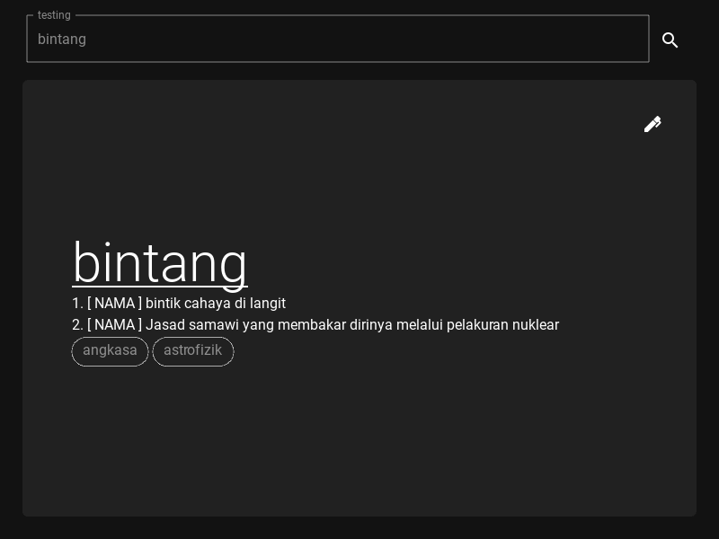

# Samudra (GUI)



Repositori ini menyimpan aplikasi berantaramuka grafik bagi aplikasi pengurusan istilah, [Samudra](https://github.com/samudradev/samudra).
Aplikasi ini direka menggunakan [Kivy](https://kivy.org/) dengan bantuan [KivyMD](https://kivymd.readthedocs.io/en/1.1.1/).

## Pemasangan

Buat masa sekarang, cara untuk memasang aplikasi ini ialah dengan pemasangan Python tersendiri.
Apabila sudah stabil, insyaAllah boleh pasang secara `.exe` terus.

1. Klon repo ini.
    ```bash
    git clone https://github.com/samudradev/samudra-gui/
    ```

2. Dapatkan pakej-pakej yang diperlukan menggunakan [poetry](https://python-poetry.org/)
    ```bash
    poetry install
    ``

3. Laksanakan aplikasi
    ```bash
    poetry run main.py
    ```